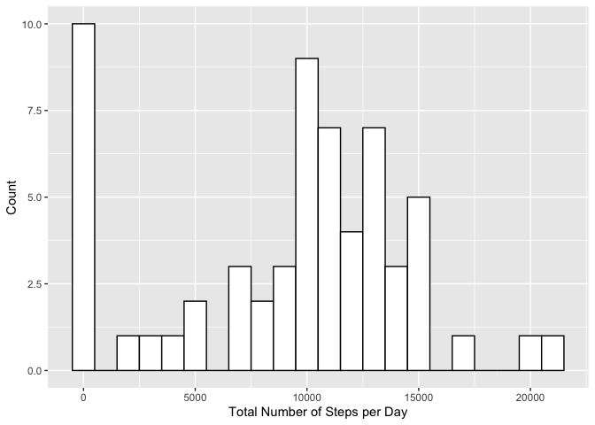
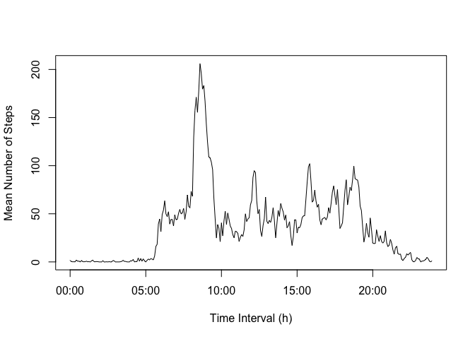
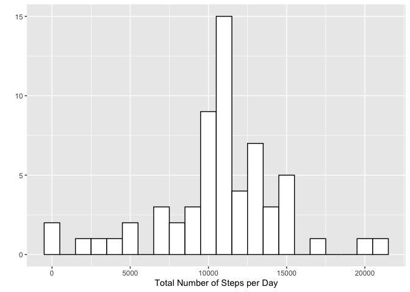
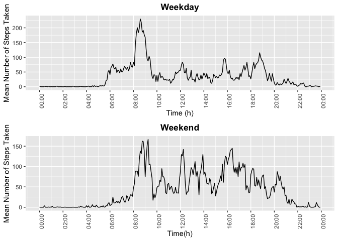

# Reading Data

```r
library(dplyr)
```

```
## Warning: package 'dplyr' was built under R version 3.6.2
```

```
## 
## Attaching package: 'dplyr'
```

```
## The following objects are masked from 'package:stats':
## 
##     filter, lag
```

```
## The following objects are masked from 'package:base':
## 
##     intersect, setdiff, setequal, union
```

```r
library(ggplot2)
```

```
## Warning: package 'ggplot2' was built under R version 3.6.2
```

```r
dat <- read.csv("activity.csv")
dat2 <- tbl_df(dat)
```

```
## Warning: `tbl_df()` is deprecated as of dplyr 1.0.0.
## Please use `tibble::as_tibble()` instead.
## This warning is displayed once every 8 hours.
## Call `lifecycle::last_warnings()` to see where this warning was generated.
```

# What is the mean number of steps taken PER DAY?  

Group the data according to the dates  
        

```r
dat_grp <- group_by(dat2, date)
```
        
Summarise the data and count the TOTAL number of steps per day  
        

```r
total_perday <- summarise(dat_grp, sum(steps, na.rm = TRUE))
```

```
## `summarise()` ungrouping output (override with `.groups` argument)
```

```r
total_perday
```

```
## # A tibble: 61 x 2
##    date       `sum(steps, na.rm = TRUE)`
##    <fct>                           <int>
##  1 2012-10-01                          0
##  2 2012-10-02                        126
##  3 2012-10-03                      11352
##  4 2012-10-04                      12116
##  5 2012-10-05                      13294
##  6 2012-10-06                      15420
##  7 2012-10-07                      11015
##  8 2012-10-08                          0
##  9 2012-10-09                      12811
## 10 2012-10-10                       9900
## # … with 51 more rows
```
        
### Plot histogram of the total number of steps taken each day  
        

```r
total_perday <- rename(total_perday, TotalSteps = `sum(steps, na.rm = TRUE)`)
qplot(total_perday$TotalSteps, 
      geom = "histogram", 
      binwidth = 1000, 
      ylab = "Count",
      xlab = "Total Number of Steps per Day",
      fill = I("white"),
      col = I("black"))
```

<!-- -->
        
### Mean and median daily number of steps taken  
        

```r
avg_count <- summarise(total_perday, 
          MeanSteps = mean(TotalSteps, na.rm = TRUE), 
          MedianSteps = median(TotalSteps, na.rm = TRUE))
avg_count
```

```
## # A tibble: 1 x 2
##   MeanSteps MedianSteps
##       <dbl>       <int>
## 1     9354.       10395
```

### What is the average daily activity pattern?
        
Group the data by interval & find MEAN at EACH INTERVAL  
        

```r
group_interval <- group_by(dat2, interval)
mean_interval <- summarise(group_interval, MeanSteps = mean(steps, na.rm = TRUE))
```

```
## `summarise()` ungrouping output (override with `.groups` argument)
```
        
Convert Interval to timeframes  
        

```r
temp2 <- mapply(function(x, y) paste0(rep(x, y), collapse = ""), 0, 4 - nchar(mean_interval$interval))
mean_interval$interval <- paste0(temp2, mean_interval$interval)
mean_interval$time <- format(strptime(mean_interval$interval, format="%H%M"), format = "%H:%M")
```
        
### plot line graph  
        

```r
plot(type = "l", 
     x = strptime(mean_interval$time, format = "%H:%M"), 
     y = mean_interval$MeanSteps, 
     xlab = "Time Interval (h)", 
     ylab = "Mean Number of Steps")
```

<!-- -->
        
### 5 min interval with *max steps*  
        

```r
mean_interval %>% 
        filter(MeanSteps >= max(mean_interval$MeanSteps)) %>%
        select(interval)
```

```
## # A tibble: 1 x 1
##   interval
##   <chr>   
## 1 0835
```

# Input missing values.
        
Number of missing values - figure out which values are missing  
        

```r
sum(is.na(dat$steps))
```

```
## [1] 2304
```
        
Fill in the missing dataset
*Merge the mean interval steps to the Original Data*  
This produces a copy of the *ORIGINAL* data set with the mean interval steps for each interval  


```r
temp3 <- mapply(function(x, y) paste0(rep(x, y), collapse = ""), 0, 4 - nchar(dat2$interval))
dat2$interval <- paste0(temp3, dat2$interval)
dat2$time <- format(strptime(dat2$interval, format="%H%M"), format = "%H:%M")
interval_merge <- merge(dat2, mean_interval, by = "interval")
interval_merge <- select(interval_merge, -(c(time.x, time.y)))
```

### Fill in the NA values in "steps" with values from MeanSteps for that interval using a For loop  


```r
for (i in 1:nrow(interval_merge)){
        if(is.na(interval_merge[i, "steps"]) == TRUE){
                interval_merge[i, "steps"] <- interval_merge[i, "MeanSteps"]
        } 
}
```

Group *NEW ADJUSTED* data according to the dates  
        

```r
dat_filled_grp <- group_by(interval_merge, date)
```

### Summarise the data and count NEW TOTAL number of steps per day    
        

```r
total_NEW <- summarise(dat_filled_grp, sum(steps, na.rm = TRUE))
```

```
## `summarise()` ungrouping output (override with `.groups` argument)
```

### Plot histogram of adjusted data to find the total number of steps taken each day   
        

```r
total_NEW <- rename(total_NEW, TotalSteps = `sum(steps, na.rm = TRUE)`)
qplot(total_NEW$TotalSteps, 
      geom = "histogram", 
      binwidth = 1000, 
      xlab = "Total Number of Steps per Day",
      fill = I("white"),
      col = I("black"))
```

<!-- -->

### Mean and median daily number of steps AFTER ADJUSTMENT   
        

```r
adj_avg_count <- summarise(total_NEW, 
                       MeanSteps = mean(TotalSteps, na.rm = TRUE), 
                       MedianSteps = median(TotalSteps, na.rm = TRUE))
adj_avg_count
```

```
## # A tibble: 1 x 2
##   MeanSteps MedianSteps
##       <dbl>       <dbl>
## 1    10766.      10766.
```

The difference in results from filling in the missing values is the tendency of the results towards normality as mean = median after adjustment.

### Differences in activity pattern between weekdays and weekends.  
Allocate the days of the week to the dataset  
        

```r
interval_merge$date <- as.Date(interval_merge$date)
interval_merge$Weekday <- weekdays.Date(interval_merge$date)
```

Assign the levels "Weekend" and "Weekday" to the days of the week.  
        

```r
for (i in 1:nrow(interval_merge)){
        if(interval_merge[i, "Weekday"] == "Saturday" | interval_merge[i, "Weekday"] == "Sunday"){
                interval_merge[i, "Weekday"] <- "Weekend"
        } else {
                interval_merge[i, "Weekday"] <- "Weekday"
        }
}
```

Assign the levels "Weekend" and "Weekday as factors  
        

```r
interval_merge$Weekday <- as.factor(interval_merge$Weekday)
```

Group the ADJUSTED data by interval & find MEAN at EACH INTERVAL and factor for "Weekday"  
        

```r
adj_interval <- group_by(interval_merge, Weekday, interval)
adj_mean_interval <- summarise(adj_interval, MeanSteps = mean(steps, na.rm = TRUE))
```

```
## `summarise()` regrouping output by 'Weekday' (override with `.groups` argument)
```

```r
adj_mean_interval$time <- as.POSIXct(strptime(adj_mean_interval$interval, format="%H%M"), format = "%H:%M")
```

Filter according to the interval "Weekday"  
        

```r
a_weekday <- filter(adj_mean_interval, Weekday == "Weekday")
a_weekend <- filter(adj_mean_interval, Weekday == "Weekend")
```

Load the package "Scales" in order to adjust the datetime axis using ggplot2  
        

```r
library(scales)
```

```
## Warning: package 'scales' was built under R version 3.6.2
```

### Plot for WEEKDAY  
        

```r
a_weekday_plot <- ggplot(data = a_weekday, aes(x = time, y = MeanSteps)) +
        geom_line() +
        scale_x_datetime(date_labels = "%H:%M", date_breaks = "2 hours") +
        theme(axis.text.x = element_text(angle = 90, hjust = 1), 
              plot.title = element_text(face = "bold", hjust = 0.5)) +
        xlab("Time (h)") +
        ylab("Mean Number of Steps Taken") +
        labs(title = "Weekday")
```

### Plot for WEEKEND  
        

```r
a_weekend_plot <- ggplot(data = a_weekend, aes(x = time, y = MeanSteps)) +
        geom_line() +
        scale_x_datetime(date_labels = "%H:%M", date_breaks = "2 hours") +
        theme(axis.text.x = element_text(angle = 90, hjust = 1),
              plot.title = element_text(face = "bold", hjust = 0.5)) +
        xlab("Time(h)") +
        ylab("Mean Number of Steps Taken") +
        labs(title = "Weekend")
```

Require the "gridExtra" package  
        

```r
library(gridExtra)
```

```
## 
## Attaching package: 'gridExtra'
```

```
## The following object is masked from 'package:dplyr':
## 
##     combine
```

### Combine the plots together  
        

```r
grid.arrange(a_weekday_plot, a_weekend_plot, ncol = 1, nrow = 2)
```

<!-- -->
